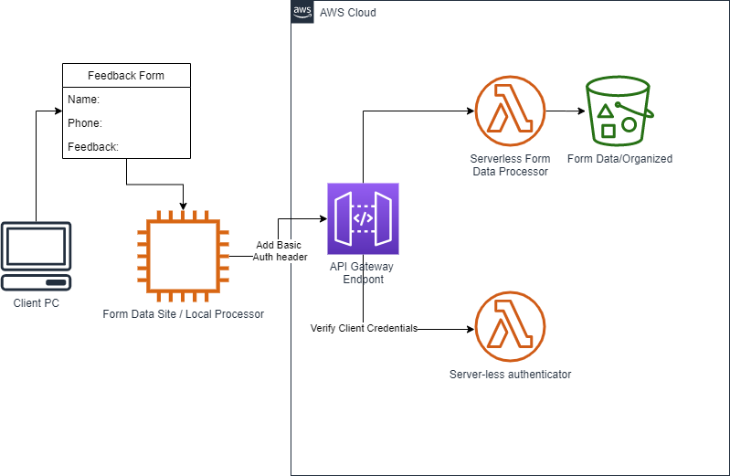

# Form Processor User Guide

## Overview

This solution is designed for a situation, where the site owner wants to take advantage of AWS infrastructure to  store and process form data, where the site itself is not hosted on AWS. This usually happens for legacy reasons , such as form data processing has to happen now, but the proper move of the rest of the site can be done at a later time, if ever. The site owner could be pretty happy with the hosting service - and there is no incentive to move the actual site.  

Form processor is user-deployed cloud solution (we only provide the software and professional installation services) to process and store application form data. The high-level design of this solution is shown on the diagram below.

 

The solution is made of a few components, namely:

* Local processor: a CGI script or a Node JS (or similar) component deployed with the actual site. This particular version of the solution assumes the site is deployed on an application server, or a web server capable of running a CGI script, such as Apache. 
* API Gateway - is an existing AWS component, which requires configuration for the solution to work. 
* Serverless Form Data Processor - is a custom component (Java). Deployable binaries, documentation and installation services are available, when the solution is purchased via Upwork. 
* Serverless Authenticator - is a custom component (Java). Binaries and professional installation are available.
* Form data bucket - is an existing AWS service which requires configuration for the solution to work.

Following events take place, when a user submits forms data via the client's form page:

* Form is submitted to the local path - local processor is a server component, which can receive submitted form data. 
* Form processor then builds a basic authentication header, and forwards form data, in the same format it received, to the form processing API endpoint. 

## Form Data site / Local processor 

...is current user's application, which needs to collect form data. This application is hosted outside AWS, on a hosting service, for example. In many cases, such service would offer a capability to email form data, but in many cases email is not where you need this data. This solution offers to store form data on Amazon S3, which is a durable and inexpensive long-term storage, which can handle a large volume of data. The hosted application will offer other features, such as data analytics in the near future.

There is a sample application made with Node JS, which demonstrates how to use this service:

https://github.com/bezrukavyy/form-processor-client-node-basic-auth

A more detailed description of the application can found at the link location above. The reason why this Local (not in the cloud) component exists - is because we want to limit who sends information to the processor deployed in the cloud. The "local" processor will communicate with the cloud solution using credentials distributed during installation. This means only users coming from YOUR site can submit form data, and no Denial of Service attack is possible if the users on your site are properly authorized. 

## Installation and Configuration

For professional installation, configuration and integration work, please reach out to me via Upwork:

https://www.upwork.com/o/profiles/users/~01b1cf90a66cfa5bfe/

In fact, you probably have found this project via Upwork - so you've already found me :) 

If you're a developer/administrator - installation documentation as well as distributable files are available by purchasing this solution via Upwork. Reach out to me for more details about it. It is not too difficult to install this on your own, although experience with AWS cloud services is required if you want to do this work on your own. 

